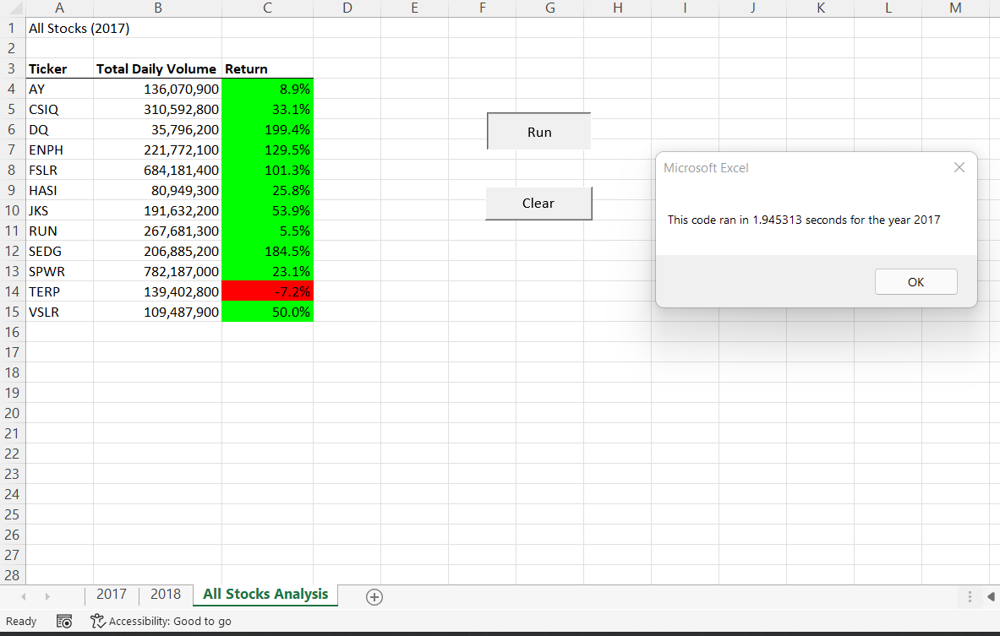
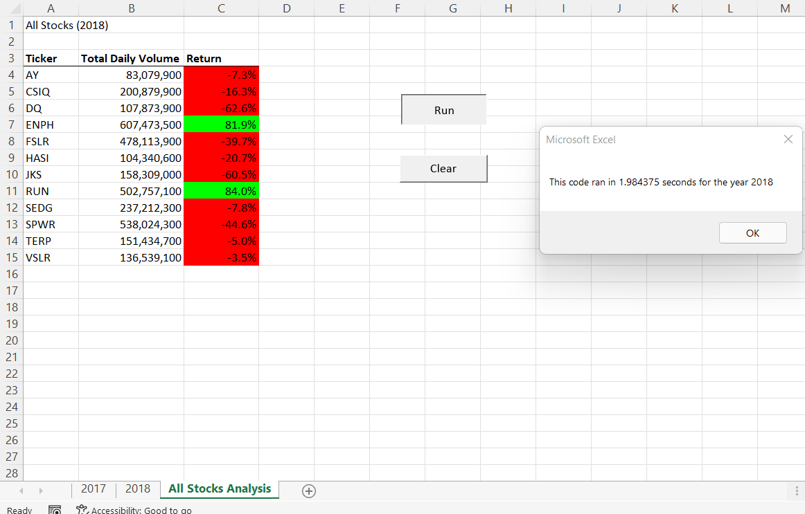

# Written Analysis of Results

## Project Background
We are helping Steve analyze a handful of green energy stocks, in addition to "DQ" to understand the industry.

## Project Purpose
We developed a VBA code to summarize the total volume and the return of each stock during a specific year.
So Steve can have an overview of each stock's performance in a specific year by running the VBA.

## Analysis and Results
- Analysis_Return
  In 2017, as you can see in , all the green energy stocks have a bull year, especifally "DQ" having an almost 200% increase from the stock price. When it comes to year 2018, see  the industy had been through some difficulties, with the price crash down quite a bit across the board.  Among all the stocks, "DQ" performed the worst, with 62.6% decrease in price. We can see DQ is the most volatile stock among all, who wins the most in a bull year but also loses the most in a bear year.
  While year 2018 was not a bull year for green energy industy, there're still 2 companies who stand the volatility, which is "ENPH" and "RUN". Their return are still quite promising, with "ENPH" increase 82% and "RUN" increase 84%.

-Analysis_Trade Volume
  From the total daily volume point of view, we can also see the total volume of "DQ" is the smallest in 2017 compared with rest of the stocks, and has grown to 107,873,900 in 2018; While "ENPH" and "RUN" have more significant trade volumes. 

-Results
  From the analysis of both trade volumes and return, my conclusion, DQ is still a company in a developing stage, who may not get much trade volumes, but may impress the industry by the rocket performance. But when it comes to a bear year, "DQ" may not stand the volatility and may tend to dip more. 

## Summary
- Original script
  In the worksheet"AllStocksAnalysis_original" from the excel file [VBS_Challenge](https://github.com/Ilylsh/kickstarter-analysis/blob/a80084e13e3c1d2960e9ceec81e6e0180701604f/Kickstarter_Challenge_Lucy%20Yuan.xlsx), we can see "TotalVolume", "startingPrices" and "endingPrices" are variables. We are in the for loop for defining the variables and open the new worksheet to print the output, and then move on to the next ticker.  
The running time is above 2secs.

- Refactored script
  In the worksheet"All Stocks Analysis" from the excel file [VBS_Challenge](https://github.com/Ilylsh/kickstarter-analysis/blob/a80084e13e3c1d2960e9ceec81e6e0180701604f/Kickstarter_Challenge_Lucy%20Yuan., we are trying to create an array instead of a variable for 'TotalVolume", "startingPrices" and "endingPrices". So we define the array first, and then create a for loop to loop through the array and get the results.
The running time is below 2secs.

## Pros and Cons of original script
- Pros
  The original script is very straight forward according to the flow chart that we will create to solve this problem. 
- Cons
  Printing the output to a new sheet is also part of the for loop, which will need to involve 2 worksheets back and forth in order to get the result printed and finish the loop. For a dataset with thousands of stocks, it may take more time in order to get the results printed.

## Pros and Cons of refactored script
- Pros
  Instead of running variables, we are creating arrays to handle different variables, which may make the script cleaner. By calculating the running time, we can also tell running loop through arrays to print the results save more time than referring back and forth between 2 worksheets to get the results printed.

- cons
  There are only 11 tickers in the dataset, so it's doable to list all 11 tickers out. But we can potentially have a better way to define tickers(i) by using Lbound and Ubound functions to get the size of the array.

